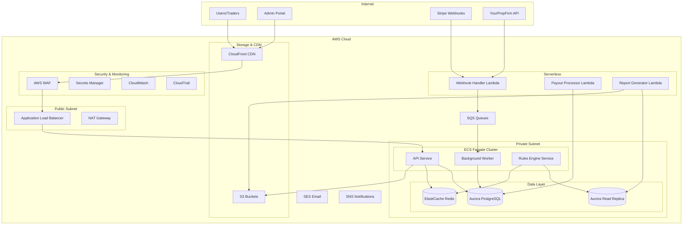

# Dynasty Futures Backend Implementation Plan

## Status Tracking

- [x] **Phase 1.1**: Terraform foundation and GitHub Actions
- [x] **Phase 1.2**: VPC and networking modules (deployed)
- [x] **Phase 1.3**: IAM users and groups (deployed)
- [ ] **Phase 1.4**: Aurora PostgreSQL setup (Terraform module TODO)
- [ ] **Phase 1.5**: Redis cache setup (Terraform module TODO)
- [x] **Phase 2.0**: Application scaffold (TypeScript, Prisma, Express, Docker)
- [ ] **Phase 2.1**: Authentication system (JWT, OAuth, MFA)
- [ ] **Phase 3**: Challenges & Accounts
- [ ] **Phase 4**: Rules Engine
- [ ] **Phase 5**: Payouts & Admin
- [ ] **Phase 6**: Polish & Launch

---

## Executive Summary

This plan outlines the complete backend architecture for Dynasty Futures, a proprietary futures trading firm. The system will handle user authentication, challenge management, real-time trading rule enforcement, and automated payouts using TypeScript, Prisma ORM, AWS Aurora PostgreSQL, ECS Fargate (with Lambda for auxiliary tasks), and Terraform for infrastructure.

---

## 1. Database Schema Design (Prisma + Aurora PostgreSQL)

### Core Entities

```
Users           -> Accounts (1:many)
Accounts        -> Challenges (1:many)
Accounts        -> Trades (1:many)
Accounts        -> Payouts (1:many)
Accounts        -> RuleViolations (1:many)
Users           -> KYCDocuments (1:many)
Users           -> AuditLogs (1:many)
```

### Key Tables

**Users & Authentication**
- `users` - Core user data (id, email, name, role, status, created_at)
- `user_credentials` - Password hashes, MFA secrets
- `oauth_accounts` - Google OAuth connections
- `kyc_documents` - Identity verification documents (S3 references)
- `sessions` - Active sessions (can be Redis-backed)

**Accounts & Challenges**
- `account_types` - Configuration table (5K, 10K, 25K, etc. with rules)
- `accounts` - Trader accounts (user_id, account_type_id, status, balance, drawdown)
- `challenges` - Challenge instances (account_id, phase, profit_target, status)
- `challenge_rules` - Rule definitions per account type
- `trading_days` - Track minimum trading day requirements

**Trading & Rules**
- `trades` - Trade history synced from YourPropFirm
- `daily_snapshots` - End-of-day P&L, drawdown, balance snapshots
- `rule_violations` - Recorded violations (type, severity, timestamp)
- `news_events` - Restricted trading periods

**Payouts**
- `payouts` - Payout requests (amount, status, method, processed_at)
- `payout_schedules` - Recurring payout configurations
- `tax_documents` - 1099 generation records

**Admin & Audit**
- `audit_logs` - All financial and administrative actions
- `support_tickets` - Customer support requests
- `admin_notes` - Internal notes on accounts/users

### Indexing Strategy
- Composite indexes on (user_id, status) for account queries
- Timestamp indexes for time-series queries (trades, daily_snapshots)
- Partial indexes on active accounts for rule engine queries
- GIN indexes for JSONB fields (trade metadata, rule configurations)

---

## 2. AWS Architecture

### Architecture Diagram



### Compute Services

**ECS Fargate (Main Backend)**
- **API Service**: REST API handling all client requests
- **Background Worker**: Async job processing (trade syncing, notifications)
- **Rules Engine Service**: Real-time rule monitoring and enforcement

**Lambda (One-off Tasks)**
- `webhook-handler`: Process Stripe/YourPropFirm webhooks
- `payout-processor`: Execute scheduled payouts
- `report-generator`: Generate tax documents and reports
- `daily-snapshot`: End-of-day calculations and snapshots

### Database Configuration (Aurora PostgreSQL)
- **Writer Instance**: db.r6g.large (2 vCPU, 16 GB RAM)
- **Reader Instance**: db.r6g.medium (1 vCPU, 8 GB RAM)
- **Auto-scaling**: 1-3 read replicas based on CPU utilization
- **Backup**: 7-day automated backups, point-in-time recovery
- **Multi-AZ**: Enabled for high availability

### Caching (ElastiCache Redis)
- **Cluster**: cache.r6g.medium (1 node initially)
- **Use Cases**: Session storage, rate limiting, cached account data

### Networking (VPC)
- **VPC CIDR**: 10.0.0.0/16
- **Public Subnets**: 10.0.1.0/24, 10.0.2.0/24 (ALB, NAT Gateway)
- **Private Subnets**: 10.0.10.0/24, 10.0.11.0/24 (ECS, Aurora, Redis)
- **Database Subnets**: 10.0.20.0/24, 10.0.21.0/24 (Aurora only)
- **Availability Zones**: 2 AZs minimum (us-east-1a, us-east-1b)

---

## 3. Terraform Infrastructure Structure

```
terraform/
├── environments/
│   └── prod/
│       ├── main.tf
│       ├── variables.tf
│       ├── outputs.tf
│       ├── terraform.tfvars
│       └── backend.tf
├── modules/
│   ├── networking/
│   ├── ecs/
│   ├── aurora/
│   ├── redis/
│   ├── lambda/
│   ├── s3/
│   ├── alb/
│   ├── waf/
│   ├── secrets/
│   └── monitoring/
└── shared/
    └── backend-setup/
        └── main.tf (S3 bucket + DynamoDB for state)
```

---

## 4. Estimated AWS Costs (Monthly)

| Service | Configuration | Est. Cost |
|---------|--------------|-----------|
| ECS Fargate | 3 services, 0.5 vCPU, 1GB each | $80-120 |
| Aurora PostgreSQL | db.r6g.large writer + medium reader | $350-450 |
| ElastiCache Redis | cache.r6g.medium | $90-120 |
| Application Load Balancer | 1 ALB + data transfer | $30-50 |
| NAT Gateway | 2 AZ | $70-100 |
| S3 | 100GB storage + requests | $5-10 |
| Lambda | Estimated 1M invocations | $5-20 |
| CloudWatch | Logs, metrics, alarms | $30-50 |
| Secrets Manager | 10-15 secrets | $5-10 |
| WAF | Web ACL + rules | $10-20 |
| Data Transfer | Estimated 500GB/month | $40-60 |
| **Total Estimated** | | **$715-1,010/month** |

---

## Manual Setup Required (TODOs)

Before running Terraform, complete these manual steps:

1. **Create AWS Account** - Set up AWS account and enable billing alerts
2. **Create Bootstrap IAM User** - Create a temporary IAM user for initial Terraform run
3. **Bootstrap Terraform State** - Run the backend-setup to create S3 bucket and DynamoDB table
4. **Deploy IAM + Networking** - This creates managed IAM users and Terraform service account
5. **Configure GitHub Secrets** - Use Terraform-managed service account credentials
6. **Register Domain** - (Optional) Register domain in Route53 for API

See `docs/AWS-GETTING-STARTED.md` for comprehensive step-by-step instructions.

## IAM Structure

The IAM module creates:

| Group | Policy | Use Case |
|-------|--------|----------|
| `dynasty-futures-admin` | AdministratorAccess | Infrastructure management |
| `dynasty-futures-developer` | PowerUserAccess | Application deployment |
| `dynasty-futures-readonly` | ReadOnlyAccess | Viewing/monitoring |

Plus a `dynasty-futures-terraform` service account for CI/CD automation.
